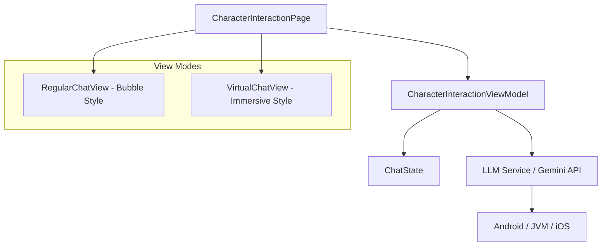

# 🗨️ Character Chat Interface Design

The Character Chat Interface is a central feature of **AndroidMaiden**, providing an interactive and immersive experience with an AI-powered character.

## 🏗️ Architecture Overview

The chat system follows the **MVVM (Model-View-ViewModel)** pattern, leveraged by **Compose Multiplatform** for a unified UI across Android, Desktop, and iOS.



## 🎨 UI Design & Modes

The interface supports two distinct interaction styles to cater to different user preferences:

### 1. Regular View (Standard Chat)
- **Visuals:** Traditional chat bubbles with avatars.
- **Interaction:** Scrollable history (`LazyColumn`) with a focus on text clarity.
- **Use Case:** Detailed information exchange and history browsing.

### 2. Virtual View (Immersive)
- **Visuals:** Full-screen character illustration (`CharacterIllustrationBox`) with semi-transparent overlays.
- **Interaction:** Minimalist input field; the character's response is displayed in a prominent top-aligned card.
- **Use Case:** Storytelling, roleplay, and casual interaction.

## 🧠 LLM Integration Logic

The core AI logic is powered by Google's **Gemini API**.

- **Multi-Model Support:** Configurable in settings (Gemini 1.5 Pro, Flash, etc.).
- **Platform Strategy:**
    - **Android:** Direct integration with `com.google.ai.client.generativeai`.
    - **Multi-platform:** `expect/actual` pattern for API validation and content generation.

## 🛠️ Data Models

```kotlin
data class ChatMessage(
    val message: String,
    val sender: Sender,
    val timestamp: Long = Clock.System.now().toEpochMilliseconds()
)

enum class Sender { 
    USER, 
    CHARACTER 
}

enum class ChatViewMode { 
    REGULAR, 
    VIRTUAL 
}
```

## 📈 Feature Roadmap for Chat

- [x] **v0.1.0:** Basic UI, View Mode switching, Android Gemini connection.
- [ ] **v0.2.0:** Response streaming implementation in `commonMain`.
- [ ] **v0.3.0:** "Memory System" - persistent conversation context.
- [ ] **v0.5.0:** Voice Interaction (STT/TTS) and character emotion-based expressions.

---
*Last Updated: Feb 2025*
