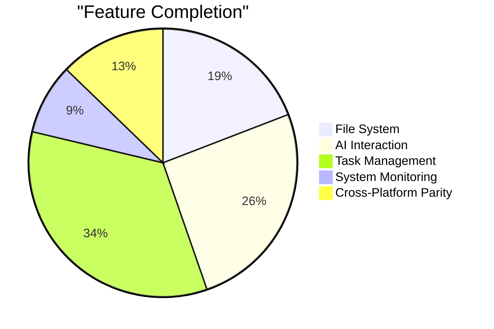

# 🗺️ AndroidMaiden Roadmap

Welcome to the development journey of **AndroidMaiden**! This roadmap outlines our vision, current status, and the exciting features planned for the future.

---

## 🚀 Current Status: Foundation (v0.1.0)
*Status: In Progress* 🏗️

Focusing on the core Android experience and basic cross-platform architecture.

- [x] **Core UI Framework:** Jetpack Compose Multiplatform integration.
- [x] **Android File System:** Basic explorer, analysis, and classification logic.
- [x] **LLM Integration (Android):** Gemini API connection for character interaction.
- [x] **Task Management:** Fundamental Todo list functionality.
- [x] **Base Components:** Extracted reusable `BaseCard` and `FileActions` toolbar.

---

## 🛤️ Short-Term: Enhancement & Polish (v0.2.0 - v0.5.0)
*Timeline: Next 3-6 Months* ⏳

### 📁 File Management 2.0
- [ ] **Real-time Sync:** Functional `FileSyncManager` for cross-device consistency.
- [ ] **Advanced Organization:** Automated "One-click Clean" and folder rules.
- [ ] **Deep Analysis:** Visual storage charts (Pie/Bar) for file distribution.

### 💬 Character & AI
- [ ] **Multi-Model Support:** Native integration for Desktop/iOS (moving beyond mocks).
- [ ] **Memory System:** Long-term conversation memory for the AI character.
- [ ] **Voice Interaction:** Basic STT (Speech-to-Text) and TTS (Text-to-Speech).

### 🛠️ Utilities
- [ ] **Hardware Monitor:** Real-time CPU/GPU/Battery status dashboard.
- [ ] **Theming Engine:** Dynamic Material You support across all platforms.

---

## 🏔️ Long-Term: Ecosystem & Intelligence (v1.0.0+)
*Timeline: 1 Year+* 🌟

### 🌐 Full Multi-Platform Parity
- [ ] **Desktop/iOS/Web:** 100% feature parity with the Android version.
- [ ] **Cloud Sync:** Secure cloud backup for tasks and AI personality settings.

### 🧠 Advanced AI Features
- [ ] **Agentic Capabilities:** AI can perform file operations (rename/move) via natural language.
- [ ] **Custom Characters:** Tooling for users to create and share character "Personalities".

### 🔌 Extensibility
- [ ] **Plugin System:** Allow 3rd party developers to add new "Skills" or file analysis modules.

---

## 📊 Visual Progress Tracker

> **Note:** This roadmap is a living document. Priorities may shift based on user feedback and technological advancements.

---
*Last Updated: Feb 2025*
