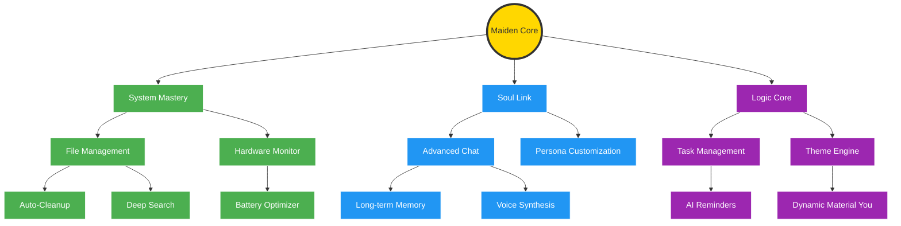

# 🌳 Skill Tree Concept Art & Design Sketches

**Designed by:** Nano Banana 🍌
**Date:** Feb 2025

This document outlines the conceptual design for the **AndroidMaiden Skill Tree**, an RPG-style progression system that visualizes the app's features as unlockable nodes.

## 🎨 Visual Concept
The Skill Tree should follow a "Futuristic Maiden" aesthetic:
- **Background:** Deep navy blue with subtle circuit-board patterns and glowing particles.
- **Nodes:** Geometric shapes (Hexagons for Core, Circles for standard skills) with neon borders.
- **Connections:** Pulsing light lines representing "data flow" between capabilities.

## 🗺️ Functional Map (Mermaid Sketch)

## 🛠️ Design Sketches Description

### 1. The "Maiden Core" (Root)
Located at the center of the screen. It is an animated hexagon that pulses with the "heartbeat" of the application. Unlocking this node enables basic app functionality.

### 2. The "System Mastery" Branch (Green)
Focuses on the Android environment.
- **File Management:** Icon of a folder with a magnifying glass.
- **Auto-Cleanup:** A broom icon glowing with green magic.
- **Hardware Monitor:** A chip icon showing real-time CPU waves.

### 3. The "Soul Link" Branch (Blue)
Focuses on AI and character interaction.
- **Advanced Chat:** Two speech bubbles.
- **Long-term Memory:** A brain icon with a save symbol.
- **Voice Synthesis:** Sound wave icon.

### 4. The "Logic Core" Branch (Purple)
Focuses on user productivity and customization.
- **Task Management:** A checklist with a magic wand.
- **Theme Engine:** A palette dripping with digital neon.

---

*Note: This design is a draft created by Nano Banana to inspire the next phase of AndroidMaiden development. Implementation started in `DraftSkillTree.kt`.*
