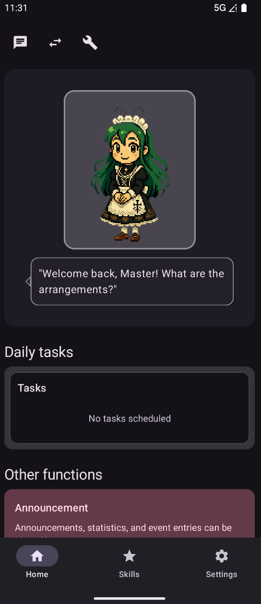
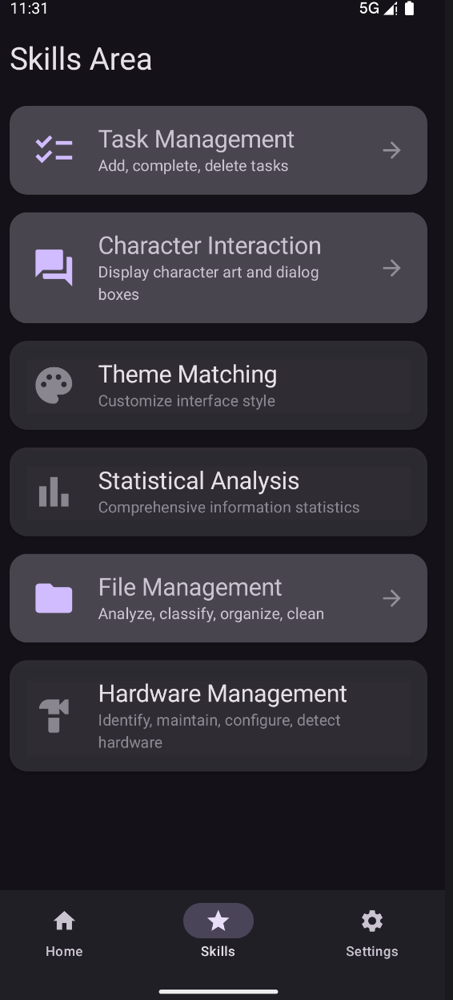
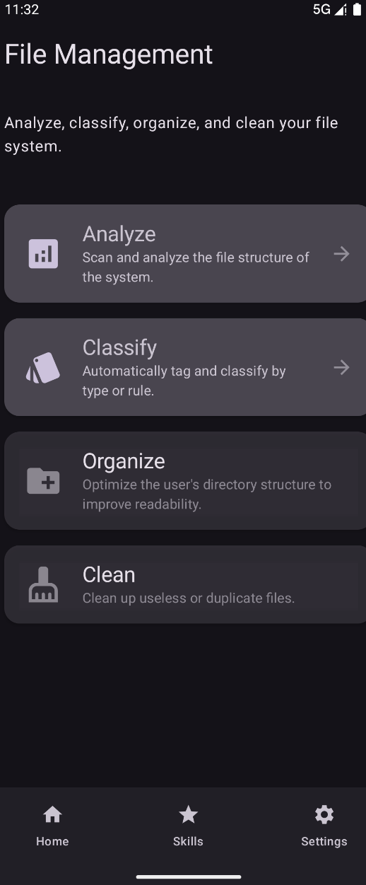
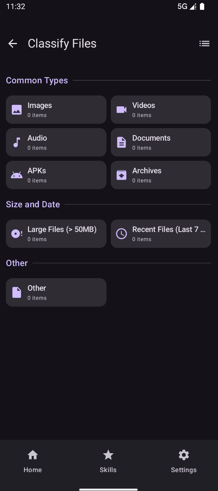

# AndroidMaiden (AM)
An android secreatary, assistanat.

**AndroidMaiden** is a modern, cross-platform assistant application built with **Kotlin Multiplatform (KMP)** and **Compose Multiplatform**. It combines an AI-powered character interaction system with powerful system utilities like file management and task tracking, aiming to be your "Digital Maiden" on Android, Desktop, and beyond.

---

## 📸 Screenshots

| Home & Interaction | Siklls Area | File Management | File Classify |
| :---: | :---: | :---: | :---: |
|  |  |  |  |
| *Character Chat & Main Dashboard* | *Funcs Overview* | *File Management* | File Classify |

---

## ✨ Key Features

### 💬 AI Character Interaction
- **Gemini Powered:** Real-time conversations using Google's Gemini LLM (1.5 Pro/Flash).
- **Dual View Modes:** Seamlessly switch between a standard chat interface and an immersive "Virtual View".
- **Advanced Settings:** Fine-tune AI behavior, safety settings, and API configurations.

### 📁 Advanced File System
- **File Explorer:** Deep navigation into the device's storage.
- **Smart Classification:** Automatically categorize files into Images, Videos, Music, Documents, and more.
- **File Analysis:** Detailed metadata inspection, size distribution, and system-level path tracking.
- **Platform Native:** Optimized file operations for Android (`java.io` & `kotlin.io`) with cross-platform abstraction.

### 📝 Daily Productivity
- **Todo List:** Efficient task management with CRUD operations and completion tracking.
- **Home Preview:** A quick-glance task widget on the home dashboard.

### 🎨 Personalization
- **Theme Engine:** Full support for Light/Dark modes and Material 3 design principles.
- **Responsive UI:** Adaptive layouts for Mobile, Desktop, and Web.

---

## 🏗️ Architecture & Tech Stack

The project follows a **Clean Architecture** approach with **MVVM** (Model-View-ViewModel) to ensure code maintainability and cross-platform sharing.

- **UI:** [Compose Multiplatform](https://www.jetbrains.com/lp/compose-multiplatform/)
- **Core Logic:** Kotlin Multiplatform (CommonMain)
- **AI Engine:** Gemini API via Ktor/REST
- **Dependency Injection:** Koin (Modular DI)
- **Concurrency:** Kotlin Coroutines & Flow
- **Data Persistence:** SQLDelight (Planned) / Settings Serialization
- **Platform Modules:**
    - `:composeApp`: UI and platform-specific entry points.
    - `:shared`: Common business logic and abstractions.
    - `:server`: (Optional) Backend components for sync/cloud features.

---

## 🗺️ Roadmap & TODO

Current Phase: **v0.1.0 Foundation** 🏗️

### High Priority (v0.2.0)
- [ ] **Data Persistence:** Implement Room/SQLDelight for offline task and chat history.
- [ ] **Desktop Parity:** Bring full LLM support to the JVM Desktop target.
- [ ] **Voice Support:** Integrate STT/TTS for natural voice chat.

### Future Vision (v1.0.0+)
- [ ] **Plugin System:** Allow users to add custom "Skills".
- [ ] **AI File Agent:** Permit the AI character to perform file operations via natural language commands.
- [ ] **iOS Deployment:** Full support and optimization for the iOS target.

*See [Roadmap.md](../Roadmap.md) for a detailed development timeline.*

---

## 🛠️ Development Setup

1. **Clone the Repo:** `git clone https://github.com/your-repo/AndroidMaiden.git`
2. **Configure API Key:** Add your Gemini API key in the app's Advanced Settings.
3. **Build:**
    - **Android:** `./gradlew :composeApp:assembleDebug`
    - **Desktop:** `./gradlew :composeApp:run`
4. **Docs:** Check the `DevDocs` folder for detailed technical guides.

---

## 🤝 Contributing

We welcome contributions! Whether it's fixing bugs, adding new file analysis modules, or improving the character's "personality", feel free to open a PR.

---

## 📄 License

This project is licensed under the **Apache License**. See the [LICENSE](../LICENSE) file for details.

---
*Generated with ❤️ by the AndroidMaiden Team*
